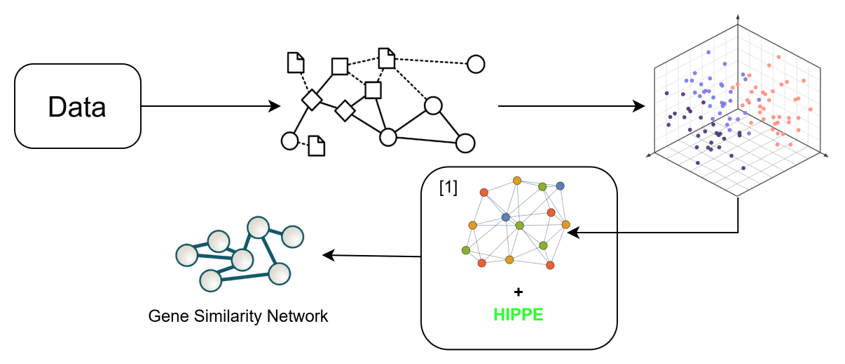
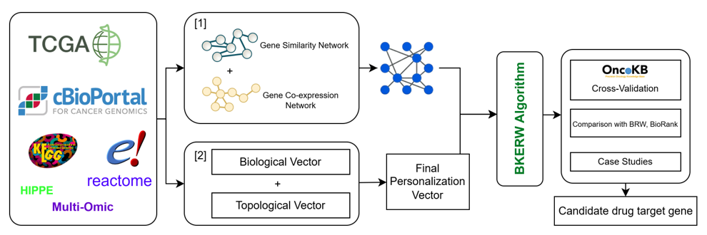
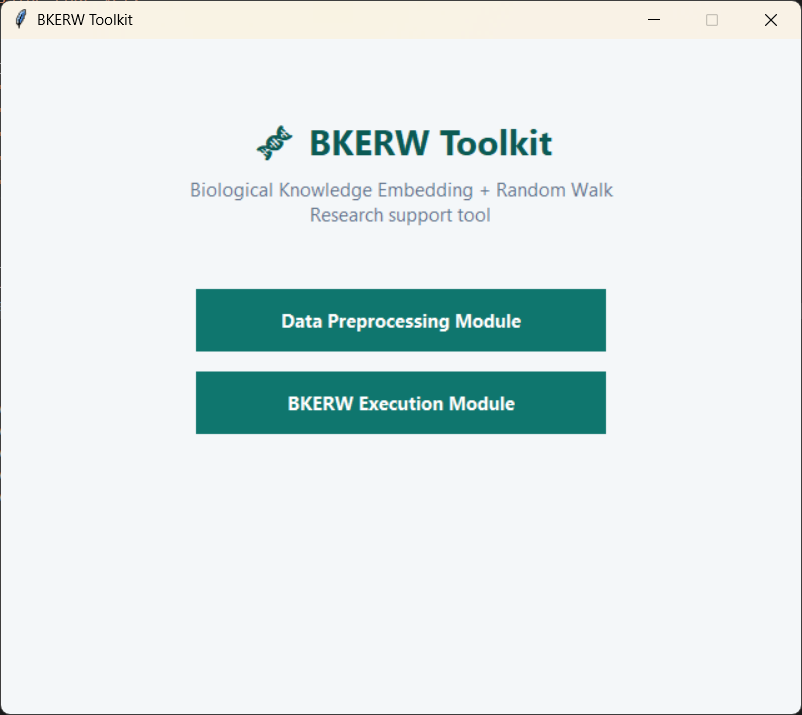
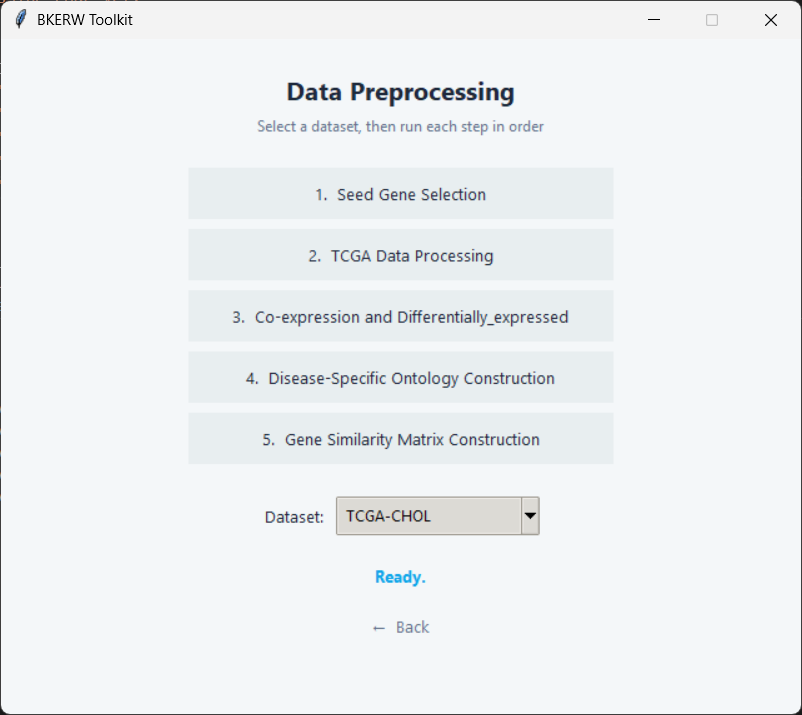
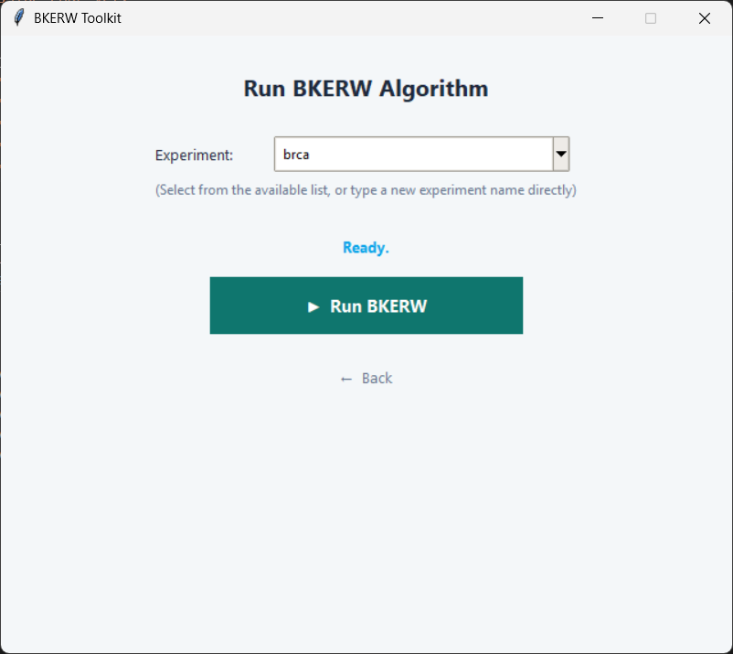

# BKERW: Biological Knowledge Embedding-Enhanced Random Walk with Restart
> A framework for integrating multi-omics data and knowledge graphs to prioritize cancer-related genes using BKERW.
---

## Author
**Hoai Nam Ly**, **Van Thanh Le**, **Van Hai Pham** <br>
>Email: [namly6702@gmail.com](mailto:namly6702@gmail.com) <br>
>Project: BKERW, 2026
---

## Citation
This project, **BKERW**, extends classical network propagation algorithms by integrating representation learning. It builds upon foundational methods such as:
> M. Gentili, L. Martini, M. Sponziello, and L. Becchetti,  
> *"Biological Random Walks: Multi-Omics Integration for Disease Gene Prioritization"*,  
> *Bioinformatics*, vol. 38, no. 17, pp. 4145–4152, 2022.  
> [https://doi.org/10.1093/bioinformatics/btac446](https://doi.org/10.1093/bioinformatics/btac446)
The original source code is available at:  
[https://github.com/LeoM93/BiologicalRandomWalks](https://github.com/LeoM93/BiologicalRandomWalks)
**BKERW** enhances the disease gene prioritization paradigm by providing:
* A unified biomedical Knowledge Graph (KG) that synthesizes protein interactions, biological pathways, functional annotations, and disease associations.
* Relational Graph Convolutional Network (R-GCN) integration to learn dense semantic embeddings for genes.
* Dynamic construction of the transition probability matrix and personalized vector within the Random Walk with Restart (RWR) algorithm.
* Elimination of manual heuristic biological scoring strategies in favor of automated embedding-based similarities.

## Introduction
Current network-based disease gene prioritization methods heavily rely on heuristic metrics, which hinders unified knowledge integration. While classical Random Walk with Restart (RWR) iteratively propagates biological signals through a protein-protein interaction (PPI) network, it often fails to capture latent biological relationships when genes lack direct physical interactions.<br>
To address this, we propose Biological Knowledge Embedding-Enhanced Random Walk with Restart (BKERW). BKERW constructs a heterogeneous Knowledge Graph (KG) and employs an R-GCN to extract semantic gene embeddings. These learned embeddings automatically derive similarities to enhance both the transition matrix and the personalization vector, allowing the framework to successfully decode critical signaling networks and therapeutic targets.


## Application Overview
BKERW is a Python-based command-line application managed via the Hydra configuration framework. It enables biomedical researchers to: 
* Execute step-by-step data preprocessing for multi-omics data.
* Construct multi-relational Knowledge Graphs from GO, KEGG, Reactome, and PPI networks.
* Train R-GCN models to learn gene embeddings via a self-supervised link prediction task.
* Run the BKERW algorithm to output ranked candidate disease genes.

## Features
| Feature | Function Description |
|---------|----------------------|
| **Run BKERW** | Prioritizes cancer genes using biological knowledge embedding-enhanced Random Walk with Restart (RWR). |
| **Knowledge Graph Builder** | Integrates Gene Ontology (GO), KEGG, Reactome, and HIPPIE protein-protein interaction (PPI) networks into a unified semantic knowledge graph. |
| **Disease Ontology Enrichment** | Filters disease-specific ontology terms based on a set of known seed genes. |
| **DE Genes & Co-expression** | Computes differentially expressed (DE) genes and constructs correlation-based co-expression networks. |
| **TCGA Analyzer** | Parses GDC sample sheets and RNA-seq data to generate tumor and normal/control expression matrices. |
| **R-GCN Representation Learning** | Learns semantic graph embeddings using Relational Graph Convolutional Networks (R-GCN) with negative sampling and self-supervised learning. |

## Requirements

- **Python Version:** 3.8 or higher

Install the required dependencies:

```bash
pip install -r requirements.txt
```

The dataset can be found [here](https://drive.google.com/drive/folders/17d4RfNq3CJvmLSJBoBoUNO09gZBtUHc3?usp=sharing).

> **Note:** Due to the large file size, the dataset could not be uploaded directly to GitHub.

## Project Structure
```
BKERW/
├── main.py                     # Launch the BKERW application
├── BKERW/                      # Core BKERW implementation
├── data_preprocessing/         # Data preprocessing scripts
├── dataset/                    # Input datasets
├── output/                     # Generated results
├── imgs/                       # Images used in the README
├── README.md                   # Project documentation
└── requirements.txt            # Python dependencies
```

## How to Launch GUI
To start the GUI, run the following command in your terminal:

```bash
python ui.py
```
## Graphical User Interface (GUI)

BKERW provides a user-friendly graphical interface that simplifies both data preprocessing and algorithm execution.

### 1. Data Preprocessing

The preprocessing module allows users to prepare biological datasets through a step-by-step workflow.

**Available functions:**

1. **Seed Gene Extraction**

   - Extract seed genes from the selected cancer dataset.

2. **TCGA Analyzer**
   - Download and process TCGA RNA-seq data using the provided manifest and sample sheet.

3. **Co-expression Network & Differentially Expressed Genes**
   - Construct the gene co-expression network.
   - Identify differentially expressed genes.

4. **Disease-Specific Ontology Construction**
   - Generate disease-specific ontology relationships from the ontology network and seed genes.

5. **Build Gene Similarity Matrix**
   - Construct the gene similarity matrix from the knowledge graph.

**Supported datasets:**

- TCGA-CHOL
- TCGA-LIHC
- TCGA-KIRC
- TCGA-THCA
- TCGA-STAD
- TCGA-COAD

---

### 2. BKERW Algorithm Execution

The GUI also provides an interface for running the BKERW algorithm.

Users only need to:

- Select or enter an experiment name.
- Click **Run BKERW**.

The application automatically loads all remaining configuration parameters (e.g., restart probability, α, β, ontology paths, co-expression network, and evaluation settings) from the Hydra configuration files.

After execution, the generated outputs, including ranking results and evaluation metrics, are saved in the corresponding `output` directory.

---

### Additional Features

- Intuitive graphical interface built with Tkinter.
- Asynchronous execution to keep the GUI responsive.
- Progress bar and execution status monitoring.
- Automatic success/error notifications.
- Support for creating custom experiment configurations.

## Graphical User Interface

The BKERW Toolkit provides a graphical user interface (GUI) designed to facilitate the execution of the complete workflow, including data preprocessing and algorithm evaluation.

<p align="center">
    
</p>

<p align="center">
<b>Figure 3.</b> Main interface of the BKERW Toolkit.
</p>

The graphical interface is organized into two primary modules:

- **Data Preprocessing Module**
- **BKERW Execution Module**

### Data Preprocessing Module

<p align="center">
    
</p>

<p align="center">
<b>Figure 4.</b> Data preprocessing module of the BKERW Toolkit.
</p>

This module enables users to perform the complete preprocessing pipeline, including:

- Seed Gene Selection
- TCGA Data Processing
- Co-expression Network Construction
- Differentially Expressed Gene Identification
- Disease-Specific Ontology Construction
- Gene Similarity Matrix Construction

### BKERW Execution Module

<p align="center">
    
</p>

<p align="center">
<b>Figure 5.</b> BKERW execution module.
</p>

The execution module allows users to specify an experiment configuration and execute the BKERW algorithm. Model parameters and dataset-specific settings are automatically retrieved from the corresponding Hydra configuration files. Upon completion, the ranking results and evaluation metrics are stored in the designated output directory.